# Frenchcab

Chaque utilisateur dispose d'une branche créée sur ```origin/dev/```
* yassine
* svetlana
* malick
* thomas

## Ressources du projet :
[Trello](https://trello.com/b/6aba1ba41df9f2136e0e2c48)


## Structure du projet


/projet-taxi-prototype
├── .github/                # Configuration CI/CD
│   └── workflows/
│       └── ci.yml          # Pipeline de test et de build
├── .gitignore
├── README.md
Règles de contribution et installation
├── backend/
│   │   └── Dockerfile
│   ├── api/
│   ├── db/                 # Code pour la connexion et les requêtes SQL
                            # Code Node.js/Express pour l'API
    .env

└── frontend/
│       └── Dockerfile
│   └── web/                # Code Angular (Frontend)
    /environement

├── tests/                  # Tous les tests (Vitest/Jest)
├── sql/

## Contributing

**Pas de push** sur la branche ```dev``` : chacun travaille sur sa branche, les fusions sont faites uniquement après validation des tests, par l'intégrateur.

Les commits sont étiquetés en fonction du type de travail qui a été effectué.
Par exemple : 
<doc>Mise à jour de la doc
<fix>Corrrection de la ligne / fichier / fonction
<feat>Ajout de la fonctionnalité

[Ensemble des règles de contribution du projet](./CONTRIBUTING.md)

## Dictionnaire de données

| Nom de champ          | Description                                                                                                                                                                                                                                                   | Type                             |
| --------------------- | ------------------------------------------------------------------------------------------------------------------------------------------------------------------------------------------------------------------------------------------------------------- | -------------------------------- |
| VendorID              | Code qui indique quel opérateur a fournit l'enregistrement de données.<br>**1 = Creative Mobile Technologies, LLC;<br>2 = VeriFone Inc.**                                                                                                                     | int                              |
| tpep_pickup_datetime  | Date et heure à la **mise en route** du compteur de course.                                                                                                                                                                                                   | timestamp                        |
| tpep_dropoff_datetime | Date et heure à **l'arrêt** du compteur de course.                                                                                                                                                                                                            | timestamp                        |
| passenger_count       | Nombre de passagers dans le véhicule<br>**Cette donnée est fournit par le chauffeur.**                                                                                                                                                                        | int                              |
| trip_distance         | Distance parcourue, en miles (~1,609m), de la course relevée par le compteur.                                                                                                                                                                                 | float                            |
| RateCodeID            | Code du taux de tarification finale, en effet à la fin de la course.<br>1=Taux standard<br>2=Taux pour l'aéroport JFK<br>3=Taux pour l'aéroport Newark<br>4=Taux pour les littoraux de Nassau ou Westchester<br>5=Tarif négocié<br>6=Tarif de groupe          |                                  |
| store_and_fwd_flag    | Cet indicateur signale si l'enregistrement de la course a été stocké dans la mémoire du véhicule avant d'être transmis, en général par manque d'une connexion au serveur.<br>1= store and forward trip<br>0= not a store and forward trip                     | int |
| PULocationID          | La zone TLC Taxi dans laquelle le compteur de course a été déclenché.                                                                                                                                                                                         | int                              |
| DOLocationID          | La zone TLC Taxi dans laquelle le compteur de course a été arrêté.                                                                                                                                                                                            | int                              |
| payment_type          | Valeur entière qui correspond à un mode de paiement.<br>1= Credit card<br>2= Cash<br>3= No charge<br>4= Dispute - _une opposition est faite auprès de la banque par le client_<br>5= Unknown<br>6= Voided trip - _la course est annulée et n'est pas chargée_ | int                              |
| fare_amount           | Le tarif calculé par le compteur de courses (temps et distance)                                                                                                                                                                                               | float                            |
| extra                 | Charges et coûts supplémentaires. Actuellement, Cette colonne inclut la surcharge des heures de pointes ou des heures de nuit : 0,50$ ou 1$.                                                                                                                  | float                            |
| mta_tax               | Taxe MTA (réseau métropolitain) déclenchée automatiquement en fonction du RateCodeID utilisé                                                                                                                                                                  | float                            |
| tip_amount            | Ce champ est peuplé automatiquement pour prendre en compte les pourboires CB                                                                                                                                                                                  | float                            |
| tolls_amount          | Montant total des péages pris en charge sur le trajet.                                                                                                                                                                                                        | float                            |
| improvement_surcharge | Depuis 2015, une surcharge d'amélioration de $0,30 participe à la mise en conformité et à l'amélioration des équipements pour les personnes à mobilité réduite. Elle est appliquée aux taxi Jaunes et Verts                                                   | float                            |
| total_amount          | Montant total de la course facturé au client. N'inclut pas les pourboires en espèce.                                                                                                                                                                          | float                            |
| congestion_surcharge  | Montant total collecté lors d'un trajet depuis et vers l'état de New York en traversant Manhattan par le sud de la 96th rue.                                                                                                                                  | float                            |

**Données géographiques à croiser avec les points de départ et d'arrivée des trajets**

| Nom du champ | Description            | Type |
| ------------ | ---------------------- | ---- |
| locationID   | Identifiant de la zone | int  |
| borough      | Quartier               | str  |
| zone         | zone du quartier       | str  |
| service_zone | zone de service        | str  |

##  Dictionnaire de termes 'métier'

TPEP - Taxicab Passenger Enhancement Program
MTA tax - Metropolitan Commuter Transportation Mobility Tax
Congestion surcharge : taxe de traversée d'unepartie spécifique de Manhattan

## ETL

### /backend/etl/extraction.py

```from __future__ import annotations```
Cela permet d'utiliser les types de données annotées dans ce script

```import argparse```
Cette bibliothèque permet de créer un programme commande ligne qui peut recevoir des arguments en ligne de commande

```import json```
Cette bibliothèque permet de travailler avec du JSON

```import time```
Cette bibliothèque permet de mesurer le temps d'exécution de certains blocs de code

```from collections import Counter```
Cette bibliothèque permet de compter les occurrences de chaque élément d'une liste

>python backend/etl/extraction.py --nrows 100000

#### Fonctionnement de l'extraction

Le fichier de données brutes téléchargées depuis [le portail de données ouvertes de la ville de New York](https://data.cityofnewyork.us/Transportation/2023-Yellow-Taxi-Trip-Data/4b4i-vvec/about_data)

```bash
backend/data/query.csv
```

Les données sont ensuite stockées dans un CSV 

```bash
backend/data/clean/
```

##### Étapes du traitement

1. le script lit les **19 colonnes** ; les 4 colonnes techniques du portail (id, version, created_at, updated_at) sont ignorées.

2. le script normalise :
    * les noms repassent au format du dictionnaire TLC (vendorid → VendorID, pulocationid → PULocationID…),
    * les dates deviennent des dates,
    * les codes convertis en entiers,
    * les montants sont convertis en décimaux

3. le script filtre ; les lignes aberrantes sont comptées puis retirées.

4. le script écrit ; une première écriture crée le fichier avec les ent^tes de colonnes, chaque enregistrement s'ajoute ensuite à la fin du dataframe

##### Règles de nettoyage

1. **date_invalide**
    * Date de départ ou d'arrivée illisible.
    * Impossible de calculer la durée.
2. **hors_annee**
    * Départ hors de 2023 _(l'export contient des courses du 31/12/2022)_
3. **duree_negative_ou_nulle**
    * Arrivée avant ou à l'heure du départ.
    * Erreur de compteur.
4. **duree_sup_6h**
    * Course de plus de 6 h.
    * Compteur resté allumé _(vu : 23 h pour 1,2 mile)_.
5. **distance_nulle_ou_aberrante**
    * Distance ≤ 0 ou > 200 miles.
    * Distance non enregistrée.
6. **montant_negatif_ou_nul**
    * Tarif ou total ≤ 0.
    * Lignes d'annulation ou de remboursement.
7. **montant_aberrant**
    * Total > 1 000 $.
    * Saisie erronée.
8. **vendor_inconnu**
    * VendorID hors 1, 2, 6, 7.
    * Code absent du dictionnaire.
9. **ratecode_invalide**
    * RatecodeID hors 1–6 et 99.
    * Code absent du dictionnaire.
10. **payment_type_invalide**
    * payment_type hors 0–6.
    * Code absent du dictionnaire.

11. **Doublons**

Est considéré 'doublon' une ligne qui est identique à une autre dans l'échantillon de donnéees traité.

![ATTENTION] Deux valeurs sont vidées sans supprimer la course : 
    * passenger_count = 0
    * RatecodeID = 99 
Ils deviennent « inconnu » (case vide).

Deux fichiers sont écrits dans backend/data/clean/
    * yellow_tripdata_2023.csv   les courses propres, 23 colonnes (les 19 du dictionnaire + 4 ajoutées). il peut peser plusieurs Go ,vérifier l'espace disque
    * rapport_extraction_2023.json  lignes lues, gardées, rejetées, taux de rejet et détail par motif.


#### Colonnes ajoutées

**cbd_congestion_fee**
0 pour 2023 (taxe créée le 5 janvier 2025), gardée pour un schéma identique d'une année à l'autre
**trip_duration_min**
durée de la course en minutes
**pickup_hour**
heure de départ (0–23)

**pickup_weekday**
jour de départ (0 = lundi, 6 = dimanche)

![ATTENTION]
 Remboursements--- une annulation apparaît en deux lignes, une négative et une positive. La négative est retirée, la positive reste : la course compte donc une fois alors qu'elle a été remboursée

• doublons --- ils ne sont détectés qu'à l'intérieur d'un même morceau , deux lignes identiques dans deux morceaux différents
• frais d'aéroport, VendorID 1 : pour les courses à l'aéroport, extra semble déjà contenir les 1,25 $ de airport_fee. La somme des colonnes dépasse alors total_amount de 1,25 $ ; se fier à total_amount
•pourboires en espèces  ----- ils ne sont pas enregistrés ; tip_amount ne concerne que les paiements par carte
• improvement_surcharge : quelques lignes sont à 0,30 $ au lieu de 1,00 $ (ancien tarif) ; elles sont gardées
•test le script a été vérifié sur un petit extrait, pas encore sur les 6 Go complets

 lancer d'abord avec --nrows 100000 et relire le rapport    python backend/etl/extraction.py --nrows 100000

 ## Problématiques

Incohérences entre colonnes et tables sql -> ajouter les quelques colonnes manquantes dans la table "trajets" et  s'assurer de la présence du champ `uid_trajet` qui est un identifiant unique auutoincrémenté et fait office de clé primaire.


## Backend Node.js

### routes

GET http://localhost:3001/api/courses = toutes les courses (pagination a 100 première course sinon crash car trop de course)

Résultat docker : 
conteneur-back  | App connecté sur le port 3001
conteneur-back  |  Connexion réussie à la base SQLite (frenchcab.db) !
conteneur-back  | Erreur SQL : null
conteneur-back  | Nombre de courses : 100

GET http://localhost:3001/api/courseID?id=1 = course par ID

## connexion db 

fichié connexion.js pour ce connecter à la db pas d'identifiant ou mdp pour ce connecter car c'est une db sqlite3

// Cible le dossier 'data' puis le fichier 'french.db' depuis l'emplacement de ce fichier
const dbPath = path.resolve(__dirname, 'frenchcab.db'); changer le nom selon votre bdd


## Prédictions

Ce module prédit **combien de minutes va durer une course de taxi jaune** (New York, 2023), à partir des informations connues **au moment du départ** : la distance, l'heure, le jour et les zones de départ et d'arrivée

```bash
backend/
├── data/
│   └── frenchcab.db                  ← base SQLite (tables trajets + localisations)
└── ML/
    ├── Taxi_PichkupHour.py          ← 1. entraînement du modèle
    ├── modele_duree_trajet.joblib   ←    modèle sauvegardé
    ├── taxi_duree_prediction.py.py     ← 2. prédiction d'une course par uid_trajet
    ├── api_prediction.py            ← 3. API FastAPI
    ├── requirements.txt             ← 4. dépendances Python
    ├── Dockerfile                   ← 4. image Docker de l'API
    └── .dockerignore
```

Le chemin complet :

```mermaid
graph LR
    frenchcabDB[frenchcab.db]
    pickupScript[Taxi_PickupHour.py]
    modelFile[modele_duree_trajet.joblib]
    predictionScript[taxi_duree_prediction.py]
    apiServer[api_prediction.py<br/>FastAPI port 8000]
    angularApp[Angular / Browser<br/>GET /api/prediction/13]
    
    frenchcabDB -->|données| pickupScript
    pickupScript -->|entraîne et sauvegarde| modelFile
    modelFile -->|charge le modèle| predictionScript
    predictionScript -->|utilise le modèle| apiServer
    angularApp -->|requête HTTP| apiServer
    apiServer -->|réponse JSON| angularApp
    
    classDef database fill:#f0fdf4,stroke:#4ade80
    classDef script fill:#eef2ff,stroke:#818cf8
    classDef model fill:#fff7ed,stroke:#fb923c
    classDef api fill:#f0f9ff,stroke:#38bdf8
    classDef frontend fill:#fdf4ff,stroke:#e879f9
    
    class frenchcabDB database
    class pickupScript,predictionScript script
    class modelFile model
    class apiServer api
    class angularApp frontend
```



### 1. Le modèle — `Taxi_PichkupHour.py`

#### Le but

Une fonction : **informations de la course → durée en minutes**

C'est de l'**apprentissage supervisé** : le modèle apprend à partir de courses passées dont on connaît la vraie durée
Comme la réponse est un nombre, c'est une **régression**

- **X** (les variables, ou *features*) : ce qu'on donne au modèle
- **y** (la cible) : `trip_duration_min`, déjà calculée par l'ETL (`load_taxi_data.py`)

#### Les étapes

| Étape | Fonction | Description |
|---|---|---|
| 1. Charger | `charger_donnees()` | |
| 2. Nettoyer | `nettoyer()` | |
| 3. Variables | `construire_variables()` | Crée `heure` et `est_weekend`, ainsi que la paire de zones `trajet_zones` (ex. `"161_236"`) |
| 4. Train / test | `train_test_split` | 80 % des courses pour apprendre, 20 % pour vérifier sur des courses jamais vues |
| 5. Baselines | `DummyRegressor`, médiane par paire, `LinearRegression` | Modèles très simples que le vrai modèle doit battre |
| 6. Entraîner | `creer_pipeline()` | Prépare les données, puis entraîne un Gradient Boosting |
| 7. Évaluer | `evaluer()` | Calcule MAE, RMSE et R², et l'importance de chaque variable |
| 8. Sauvegarder | `joblib.dump` | Écrit le fichier `modele_duree_trajet.joblib` |

#### Les variables utilisées

| Type | Variables | Traitement |
|---|---|---|
| Nombres | `trip_distance`, `heure`, `pickup_weekday`, `est_weekend`, `passenger_count` | Utilisées telles quelles |
| Peu de catégories | `quartier_dep/arr`, `zone_service_dep/arr`, `RateCodeID`, `vendorID` | **OneHotEncoder** : une colonne 0/1 par valeur |
| Beaucoup de catégories | `pu_locationID`, `do_locationID`, `trajet_zones` | **TargetEncoder** : chaque zone est remplacée par la durée moyenne de ses courses |

#### Le modèle : `HistGradientBoostingRegressor`

* `max_iter=300` : au maximum 300 arbres
* `learning_rate=0.1` : chaque arbre corrige 10 % de l'erreur restante
* `early_stopping=True` : l'entraînement s'arrête quand le modèle ne progresse plus

Le **Pipeline** regroupe la préparation des données et le modèle dans **un seul objet**. On sauvegarde cet objet, et on le réutilise tel quel pour prédire

#### Les mesures

- **MAE** : erreur moyenne en minutes. C'est la plus facile à lire
- **RMSE** : ressemble à la MAE, mais punit davantage les grosses erreurs
- **R²** : entre 0 et 1, la part de la variation expliquée (1 = parfait)
- Si le score **train** est bien meilleur que le score **test**, le modèle a appris par cœur : c'est du **surapprentissage**

#### Lancer

```bash
cd backend/ML
python Taxi_PichkupHour.py                  # avec la distance (1 million de courses)
python Taxi_PichkupHour.py 2000000          # échantillon plus grand (0 = toutes les courses)
python Taxi_PichkupHour.py --sans-distance  # seulement les zones et l'heure
```

### 2. La prédiction — `taxi_duree_prediction.py`

Ce fichier **utilise** le modèle déjà entraîné. Il ne réentraîne rien

| Fonction | Rôle |
|---|---|
| `charger_modele()` | Ouvre `modele_duree_trajet.joblib` |
| `charger_courses(db, [uid])` | `SELECT ... FROM trajets WHERE uid_trajet IN (...)`, puis la jointure avec `localisations` |
| `predire(modele, df)` | Applique `construire_variables()` (**la même** fonction qu'à l'entraînement), puis `modele.predict()` |
| `afficher(df)` | Affiche une phrase par course |
| `prediction(id_trajet)` | Fait tout : charger, prédire et afficher |

Points importants :

- Les constantes et `construire_variables` sont **importées** depuis `Taxi_PichkupHour.py`
  Ainsi, l'entraînement et la prédiction préparent les données exactement de la même façon
- `modele.feature_names_in_` donne la liste des colonnes vues pendant l'entraînement, on donne au modèle exactement ces colonnes, dans le même ordre
- Le `if __name__ == "__main__":` de `Taxi_PichkupHour.py` empêche l'entraînement de se relancer quand on importe ce fichier

#### Lancer

```bash
cd backend/ML
python taxi_duree_prediction.py.py      # lance prediction(20)
```

Résultat :

```text
la course uid_trajet 20 à 2023-01-01 start time 00:32 a durée 12 min (réelle 11 min) à localisation Manhattan/Midtown Center/Yellow Zone -> Manhattan/Upper East Side North/Yellow Zone
```

> Remarque : si la course a servi à l'entraînement, le modèle l'a déjà « vue ». La prédiction sera donc un peu trop bonne

### 3. L'API — `api_prediction.py` (FastAPI)

Angular tourne dans le **navigateur**, qui ne peut pas lancer un fichier Python. Il envoie des **requêtes HTTP**. FastAPI transforme donc la prédiction en **adresse web**

#### La route

```bash
GET /api/prediction/{uid_trajet}
```

| Partie du code | Rôle |
|---|---|
| `app = FastAPI(...)` | Crée l'application web |
| `http://localhost:4200` | Autorise Angular (port 4200) à appeler l'API (port 8000) |
| Chargement du modèle | Le modèle est chargé **une seule fois**, au démarrage, et pas à chaque requête |
| `@app.get("/api/prediction/{uid_trajet}")` | Le nombre dans l'adresse devient le paramètre `uid_trajet: int` |
| `HTTPException(404)` | Erreur renvoyée si la course n'existe pas |
| `return {...}` | Le dictionnaire est renvoyé en JSON (on convertit avec `int()` et `float()`, car le JSON ne connaît pas les types de pandas) |

#### Réponses possibles

| Route | Code HTTP | Réponse |
|---|---|---|
| `/api/prediction/13` | 200 | JSON de la course (voir ci-dessous) |
| `/api/prediction/99999999` | 404 | `{"detail": "course 99999999 introuvable"}` |
| `/api/prediction/abc` | 422 | Erreur de validation : ce n'est pas un nombre |

```json
{
  "uid_trajet": 13,
  "date": "2023-01-01",
  "start_time": "00:21",
  "duree_predite": 15,
  "duree_reelle": 14,
  "depart": "Manhattan/Midtown Center/Yellow Zone",
  "arrivee": "Manhattan/Upper East Side South/Yellow Zone"
}
```

#### Lancer sans Docker

```bash
cd backend/ML
pip install fastapi uvicorn
uvicorn api_prediction:app --reload --port 8000
```

### 4. Docker

Le projet a maintenant **3 conteneurs** :

| Service | Image | Port | Rôle |
|---|---|---|---|
| `backend` | `node:22` | 3001 | API Express (liste des courses) |
| `ml` | `python:3.14-slim` | 8000 | API FastAPI (prédiction) |
| `frontend` | nginx | 4200 | Angular |

> Le service `backend` est une image **Node** : elle ne contient pas Python. C'est pour ça que la prédiction a besoin de son propre conteneur, `ml`

#### `backend/ML/requirements.txt`

```text
fastapi
uvicorn
pandas
joblib
scikit-learn==VOTRE_VERSION
```

> Mettez **la même version** de scikit-learn que celle qui a entraîné le modèle (`pip show scikit-learn`). Avec une autre version, le fichier `.joblib` peut refuser de se charger

#### `backend/ML/Dockerfile`

```dockerfile
FROM python:3.14-slim
WORKDIR /app/ML
COPY requirements.txt .
RUN pip install --no-cache-dir -r requirements.txt
COPY . .
EXPOSE 8000
CMD ["uvicorn", "api_prediction:app", "--host", "0.0.0.0", "--port", "8000"]
```

#### Service dans `docker-compose.yml`

```yaml
  ml:
    build: ./backend/ML
    container_name: conteneur-ml
    ports:
      - "8000:8000"
    volumes:
      - ./backend/data:/app/data
    restart: always
```

* `ports "8000:8000"` : le port 8000 du PC mène au port 8000 du conteneur

#### Lancer

```bash
cd C:\python-projs\frenchcab
docker compose up --build
```

Puis ouvrir [http://localhost:8000/api/prediction/13](http://localhost:8000/api/prediction/13)

### Ordre de lancement (résumé)

1. `python Taxi_PichkupHour.py` → crée le modèle `.joblib` (seulement si les données changent)
2. `python taxi_duree_prediction.py.py` → vérifie qu'une prédiction marche
3. `uvicorn api_prediction:app --port 8000` → vérifie l'API sans Docker
4. `docker compose up --build` → lance tout : backend, ml et frontend
S